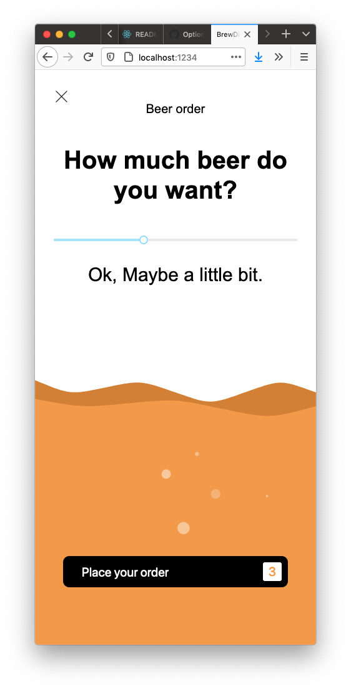

# BrewDive
A front-end exercise using react and a few animations libraries.



> node version: v14.13.0

Demo of the app here: [https://cranky-kilby-b9f0fe.netlify.app](https://cranky-kilby-b9f0fe.netlify.app)

## How to run the app on your computer
Run the project on your computer. It will be available at 
[http://localhost:1234/](http://localhost:1234/)  
`npm run dev` will watch for file changes and new import  
it will automatically update the app in your web browser.
```
npm install
npm run dev
```
## Ready to deploy on Netlify
Using [Parcel](https://parceljs.org/) as bundler. 
Fork the project on your Github account and deploy it on [Netlify](https://www.netlify.com/) for free.  
A configuration file and the deploy script are already set.  

the following command will only build the project for production. It will not watch for file changes.
```
npm run build
```
### Difficulties
- **_Mobile accessibility_**   
Refactoring had to be done on the styling, I originally used `vh` at many places but I realized after deploying and trying on a phone that it was breaking most of the layout. Few issues : items overlapping making interaction not possible anymore, animation happening away from their initial place.
- **_Animations_**   
The animations where a tough part, I don't have much experience with animation or SVG so I had to take time to learn and find a suitable solution for that experimental version. I finally found and adapted [wavify](https://github.com/woofers/react-wavify), a react library that can generate waves. 
For the bubbles, I used [Particles](https://www.npmjs.com/package/react-particles-js) that I have used previously. 
From the original UI/UX I had to skip the text animation part. I wasn't far but faced different issues with other states of the application; so I decided to work on what I had and move forward.
### Improvements
- **_User experience_** 
As an app targeted for mobile, It would be interesting to implement device functionalities instead of a range slider. 
A call to action to wipe the screen up and down to fill the glass with beer. 

### Todos
- Break the layout into smaller components
- Organize the sass files for more modularity
- Find a better way to handle all the states on the page. Maybe some easier behaviour handeling with a class component and the context api.
- Animate the text when it's updated. May need need to be able to keep an history of the messages and only update when a new value is injected.
- There is a `high severity vulnerability` for *node_forge* in parcel's depencies. The documentation and the bundler devs say it has 0 impoact as it isn't used by parcel itself. We could look into that see if there's a way to fix that issue.
